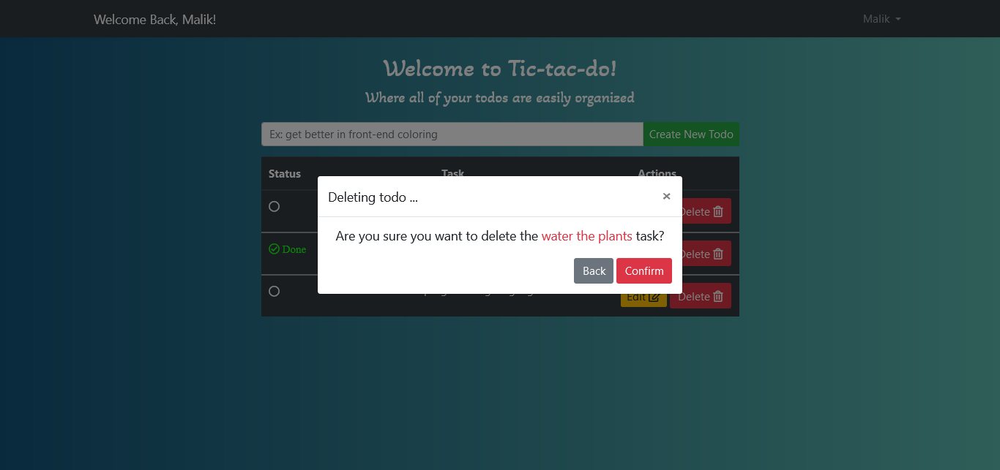

## Laravel Vue Todo App
This is a todo list app created using laravel 8 in the back-end and vue3 in front-end to manage a user CRUD operation on their todos.


<p float="left">
  
  
</p>


<p float="left">
  
  
</p>

<p float="left">
  
  
</p>

#### Back-end
- [Laravel 8](https://laravel.com/)

#### Front-end
- [Vue3](https://v3.vuejs.org/)
- [BootstrapVue](https://bootstrap-vue.org/)
- [Bootstrap 5](https://getbootstrap.com/)
- [Font Awesome 5](https://fontawesome.com/)


## Installation
1. Clone the project repository using ```git clone https://github.com/MalikHesham/TodoApp-Laravel-Vue```.
2. Run ```composer install``` to install third party packages and dependencies.
3. Check the .env.example file and create a database for this project.
4. Start migrating the database using ```php artisan migrate``` for users table.
5. To run the laravel development server ```php artisan serve```.
6. To install required JavaScript packages ```npm install```.
7. Run ```npm run dev``` or ```npm run watch``` if you needed to frequently update and compile the vue component or js files. 

## Permissions and Features
### User
1. The user can register a new account and then log in to their home page.
2. User can read/add/edit/update/delete a todo.
3. Editing a todo task can be either by changing the title or the status to completed or uncompleted.
4. The user can't change the status and update the title at the same time so if the title is being updated, the mark done buttons are hidden. A marked done todo can't be edited and the edit button is changed to disabled.
5. Users are asked if they really want to delete a todo in a confirmation message in the form of a pop-up modal.
6. Every user can do CRUD operation on only their own todos.
7. Adding and updating a todo constraints:
  - Title must be unique and not less than 3 characters.
  - Todo title can't be an empty string.


